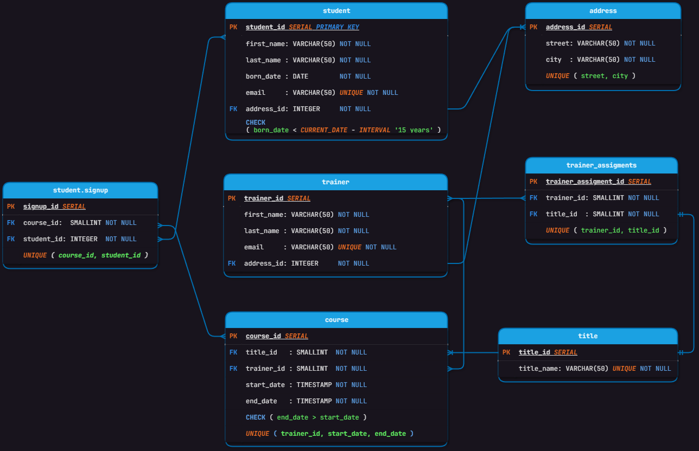

<h1>School project</h1>

## Table of contents

-   [Overview](#overview)
    -   [Screenshot](#screenshot)
-   [My process](#my-process)
    -   [Built with](#built-with)
    -   [What I learned](#what-i-learned)

-   [Author](#author)

### overview
Vytvareni databaze a vnitrni structury.

### Screenshot

### Built with
draw.io
vs-code
SQL Tools extension
postgres 

### what-i-learned
<h3>Co jsem se zde naucil:</h3>

1. Navrhovat databaze prostrednictvim diagramu.
2. Tyto diagramy nasledne pouzit pro kodovani SQL.
3. Primarni a cizi klice, typovou anotaci atd.
4. Pripravit data k naplneni databaze.
5. Pripravit VIEWS.
6. QUERIES porostrednictvim, JOINu, GROUP BY, agregaci atd.
7. Celkovou spravu nad jednoduchou databazi - CRUD.

### Author
Miroslav Viktorin
